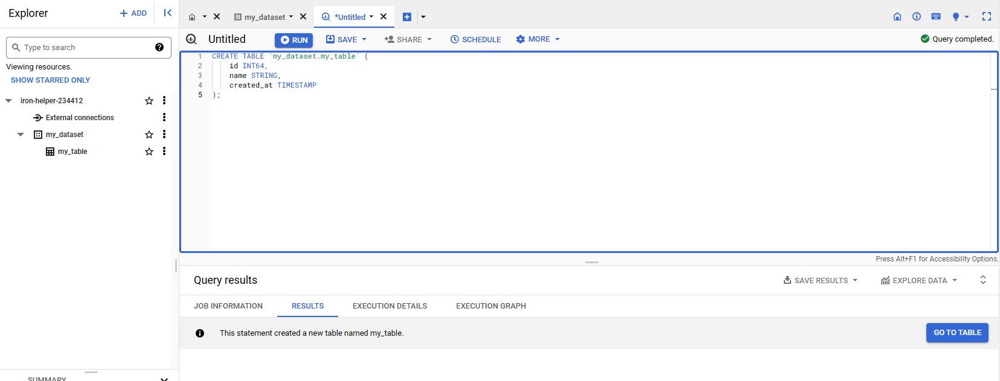

# Activate Virtual Environment

```bash
python -m venv .venv
pip install -r requirements.txt
```

# Setting Up Google Cloud CLI

## Installing Google Cloud CLI

First of all, you need to install [Google Cloud CLI](https://cloud.google.com/sdk/docs/install)

If you are using Ubuntu, you can invoke the following commands:

```bash
sudo apt-get update
sudo apt-get install apt-transport-https ca-certificates gnupg curl sudo
echo "deb [signed-by=/usr/share/keyrings/cloud.google.asc] https://packages.cloud.google.com/apt cloud-sdk main" | sudo tee -a /etc/apt/sources.list.d/google-cloud-sdk.list
curl https://packages.cloud.google.com/apt/doc/apt-key.gpg | sudo apt-key --keyring /usr/share/keyrings/cloud.google.gpg add -
sudo apt-get update && sudo apt-get install google-cloud-cli
```

## Login to GCP Account

```bash
gcloud auth login
```

```
gcloud auth login
Your browser has been opened to visit:

    https://accounts.google.com/o/oauth2/auth?response_type=xxx&...


You are now logged in as [xxx@gmail.com].
Your current project is [None].  You can change this setting by running:
  $ gcloud config set project PROJECT_ID
```

Gcloud will ask you to set the project id. You can get the Project ID by accessing your [project page](https://console.cloud.google.com/)


```bash
gcloud config set project xxx-xxx-xxx
```

## Login to GCP Account with ADP

```bash
gcloud auth application-default login
```

```
Your browser has been opened to visit:

    https://accounts.google.com/o/oauth2/auth?response_type=code&...


Credentials saved to file: [/home/gofrendi/.config/gcloud/application_default_credentials.json]

These credentials will be used by any library that requests Application Default Credentials (ADC).

Quota project "iron-helper-234412" was added to ADC which can be used by Google client libraries for billing and quota. Note that some services may still bill the project owning the resource.
```

You can find your application credential JSON under `~/.config/gcloud/appllication_default_credentials.json`. You can keep the file as is.

# Big Query

## Create Dataset

Before inserting/selecting data to/from BigQuery, you need to make a dataset. In this example, we will make a dataset named `my_dataset`


## Create Table

Next, let's make a table by invoking the following query:

```sql
CREATE TABLE `my_dataset.my_table` (
    id INT64,
    name STRING,
    created_at TIMESTAMP
)
```



## Using Python to Insert Data

> __Warning:__ The following section assume you already installed `gooogle-cloud-bigquery`. You don't need to do anything if you already activate the virtual environment and install packages from `requirements.txt`

```bash
export PROJECT_ID=xxx-xxx-xxx
python bigquery/load.py
```

See [bigquery/load.py](./bigquery/load.py) for more information.


## Using Python to Get Data

```bash
export PROJECT_ID=xxx-xxx-xxx
python bigquery/extract.py
```

See [bigquery/extract.py](./bigquery/extract.py) for more information.

## Delete The Dataset

Finally, you can delete your experimentation dataset by accessing the dataset ellipsis menu.


# GCS

## Create Bucket

Let's first make a bucket. Notice that the name of your bucket has to be globally unique. In this example, we will use `<project-id>-bucket`


## Using Python to Upload Data

> __Warning:__ The following section assume you already installed `gooogle-cloud-storage`. You don't need to do anything if you already activate the virtual environment and install packages from `requirements.txt`

```bash
export PROJECT_ID=xxx-xxx-xxx
export BUCKET_NAME=xxx-xxx-xxx-bucket
python gcs load.py
```

See [gcs/load.py](./gcs/load.py) for more information.


## Using Python to Read Data

```bash
export PROJECT_ID=xxx-xxx-xxx
export BUCKET_NAME=xxx-xxx-xxx-bucket
python gcs/extract.py
```

See [gcs/extract.py](./gcs/extract.py) for more information.
