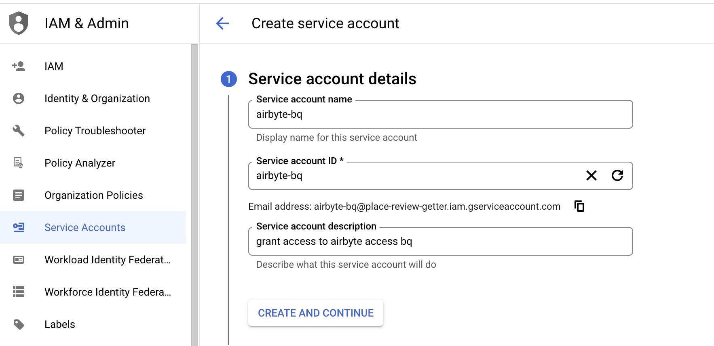
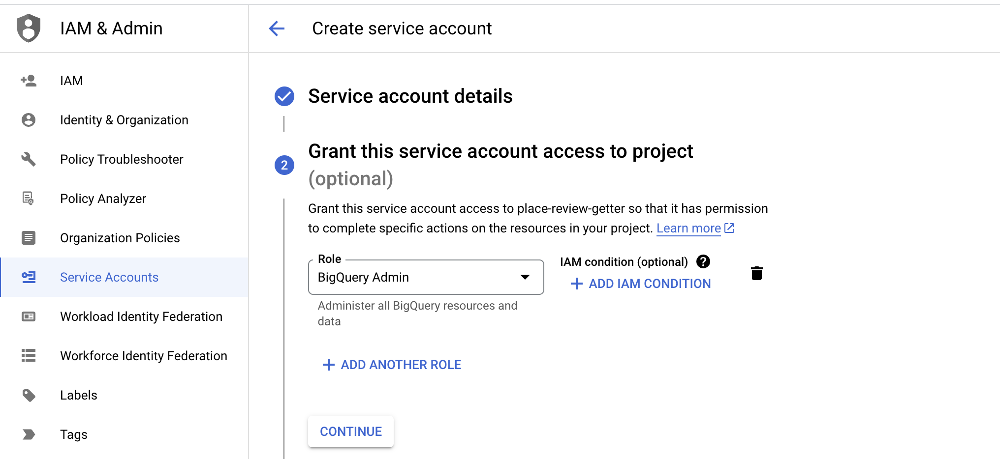
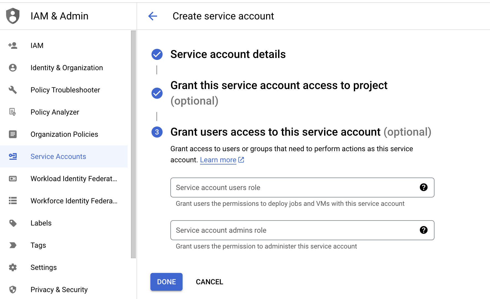
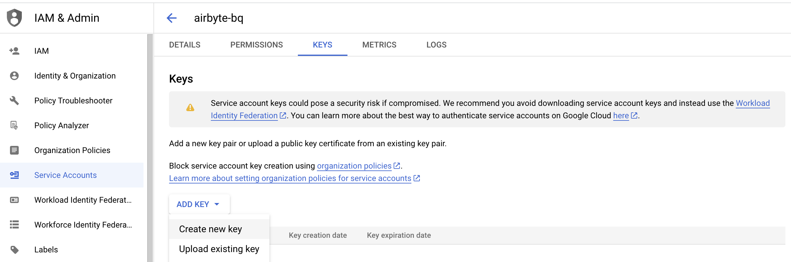
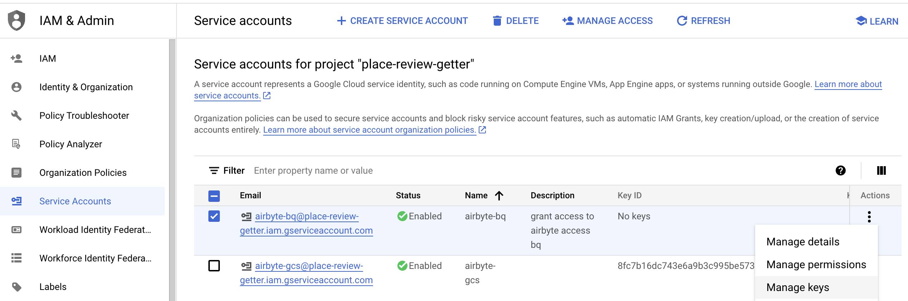
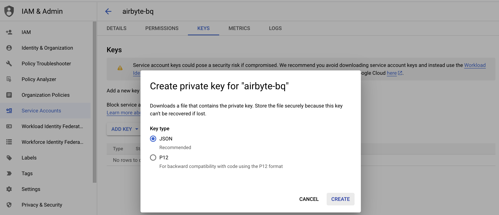
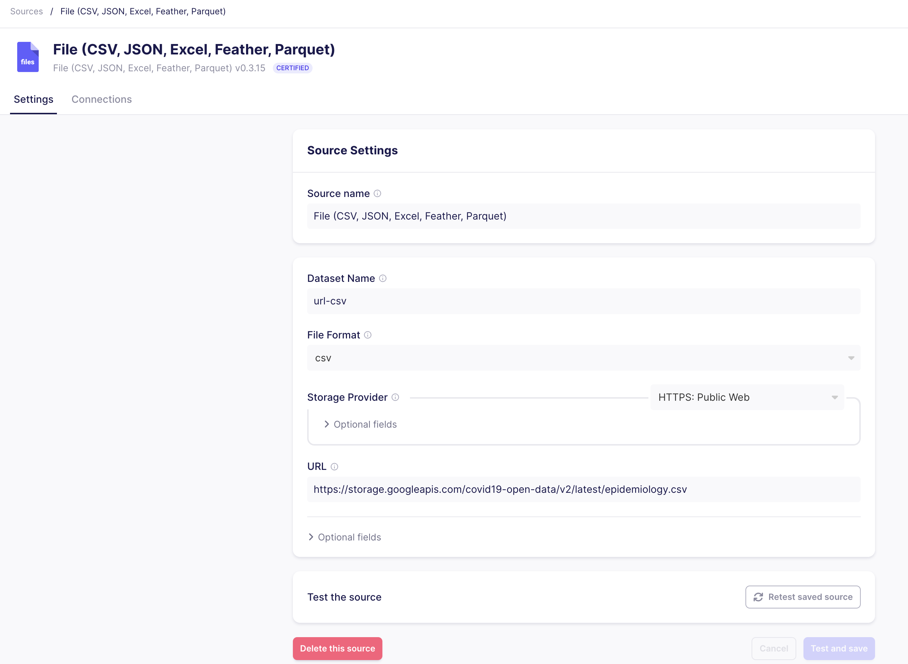
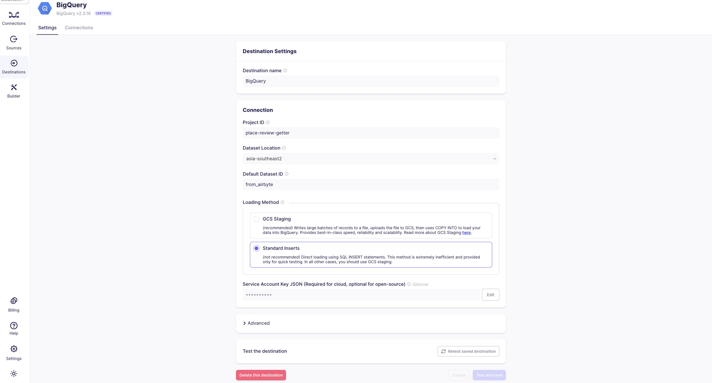
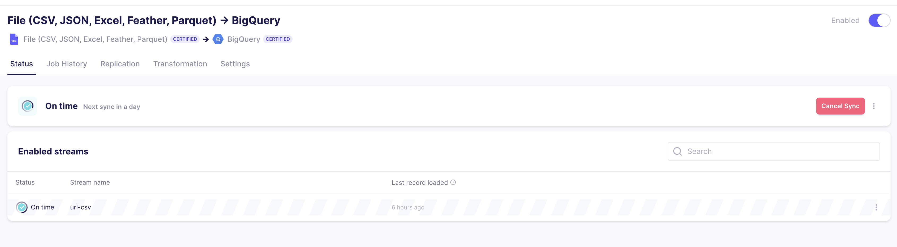

# [Day-2] Load Data to BigQuery via Airbyte

## Run Airbyte via Docker

- Execute the command below to run airbyte server via [docker-compose](./airbyte/docker-compose.yml) or download the airbyte docker-compose from the [documentation](https://docs.airbyte.com/quickstart/deploy-airbyte). 

- If you get an error message about conflict postgresqk port, change the host port to any port value except 5432.

```
postgre:
    container_name: "${COMPOSE_PROJECT_NAME:-postgre}"
    image: "postgres:12.16"
    ports:
      - "5435:5432"
    labels:
      - "com.citusdata.role=Master"
    environment: &AUTH
      - POSTGRES_PASSWORD=pass
      - POSTGRES_USER=postgres
      - POSTGRES_DB=store
      - PGUSER=postgres
      - POSTGRES_HOST_AUTH_METHOD=trust
    networks:
      - postgres-network
    volumes:
      - ./postgre-data/:/var/lib/postgresql/data/
```

and change the postgresql container port in `citus-master` as well:

```
citus-master:
    container_name: "${COMPOSE_PROJECT_NAME:-citus}_master"
    image: "citusdata/citus:12.0.0"
    ports:
      - "${COORDINATOR_EXTERNAL_PORT:-15432}:5435"
    labels:
      - "com.citusdata.role=Master"
    environment: &AUTH
      - POSTGRES_PASSWORD=pass
      - POSTGRES_USER=postgres
      - POSTGRES_DB=store
      - PGUSER=postgres
      - POSTGRES_HOST_AUTH_METHOD=trust
    networks:
      - postgres-network
    volumes:
      - ./citus-db-data/:/var/lib/postgresql/data/
```

- If you choose the first step, then rename `.env.template` file to `.env` 

- Run command to spin up docker-compose file. It will setup airbyte installation, download its dependencies and make sure the airbyte is running.

```
docker-compose -f airbyte/docker-compose.yml up
```

- Once all the installation is complete, open the browser, go to airbyte dashboard in http://localhost:8000 and login with this credential.
```
username: airbyte
password: password
```

- We are going to load Corona data from this [url](https://storage.googleapis.com/covid19-open-data/v2/latest/epidemiology.csv) to BigQuery dataset via airbyte. 

## Create Service Account on GCP 

















## Create Source in Airbyte




## Create Destination in Airbyte

- To create connection, supply the Project ID, Dataset Location and Dataset ID from GCP to the Destination dashboard.

- Also, we should copy service-account.json key and paste it to the required textbox.




## Sync Data from Airbyte Source to Destination


