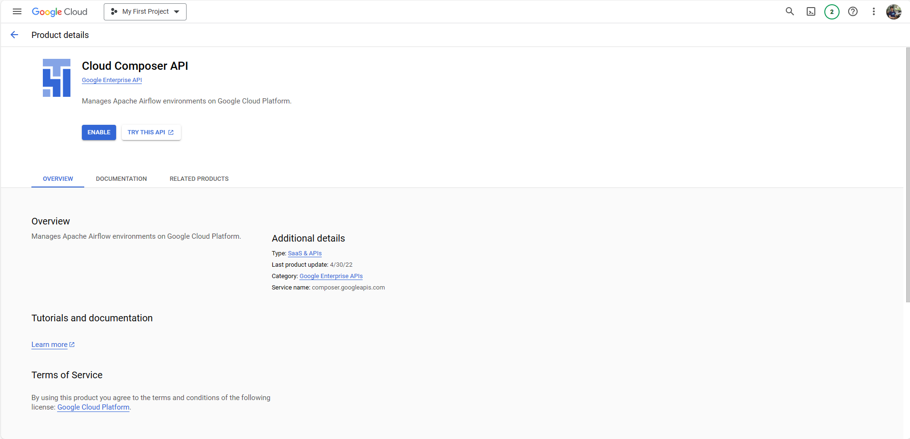
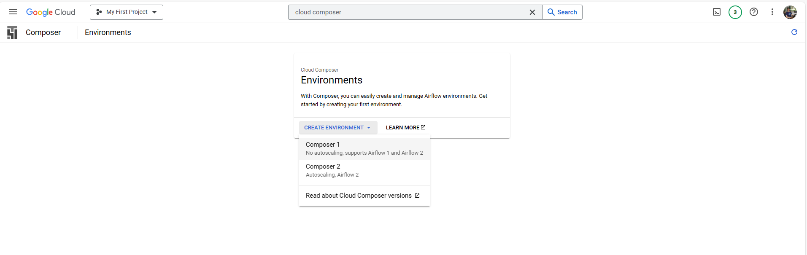
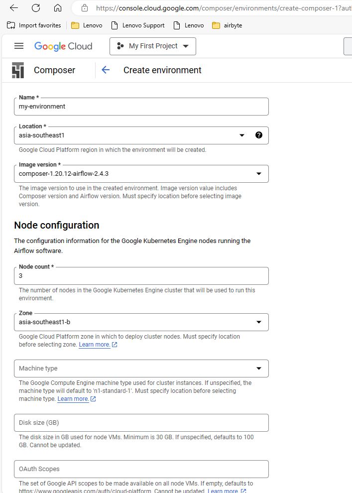
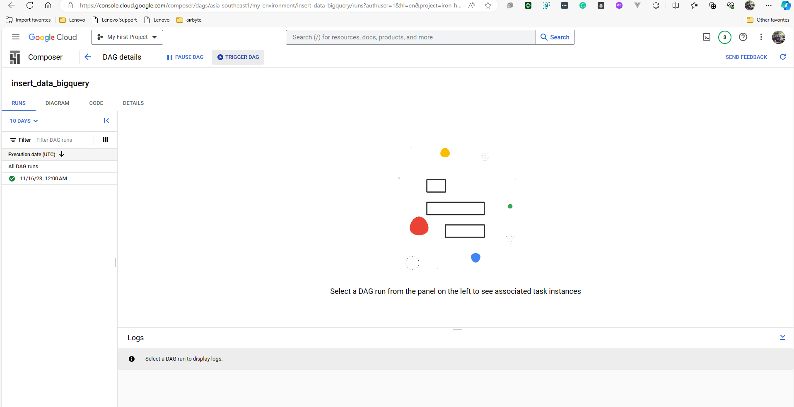
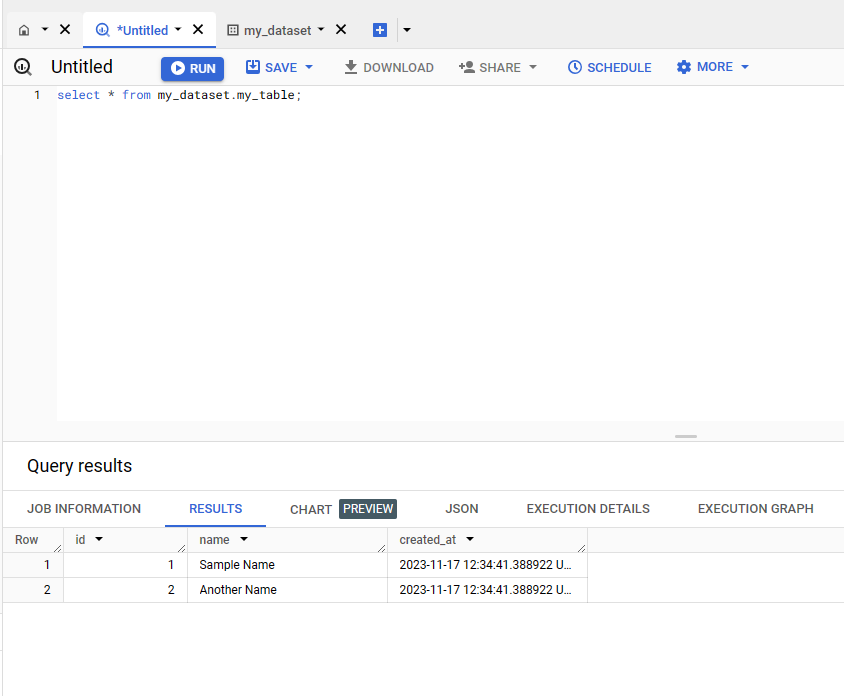

# Cloud Composer



## Creating Environment

https://cloud.google.com/composer/docs/how-to/managing/creating





## Managing DAG

https://cloud.google.com/composer/docs/how-to/using/managing-dags#python

## Upload DAG

```bash
gcloud composer environments storage dags import \
    --environment ENVIRONMENT_NAME \
    --location LOCATION \
    --source="LOCAL_FILE_TO_UPLOAD"
```

## Delete DAG

```bash
gcloud composer environments storage dags delete \
    --environment ENVIRONMENT_NAME \
    --location LOCATION \
    DAG_FILE
```

## Example

The DAG file: [cloud-composer/insert.py](cloud-composer/insert.py)

Uploading the DAG:

```bash
gcloud composer environments storage dags import \
    --environment my-environment \
    --location asia-southeast1 \
    --source="cloud-composer/insert.py"
```

The DAG should be uploaded.

o

And it should work correctly

